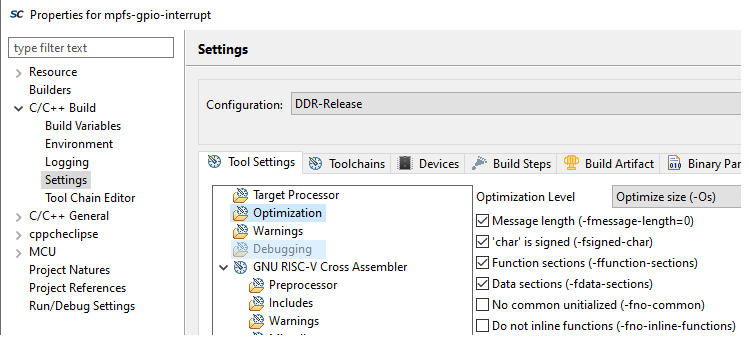
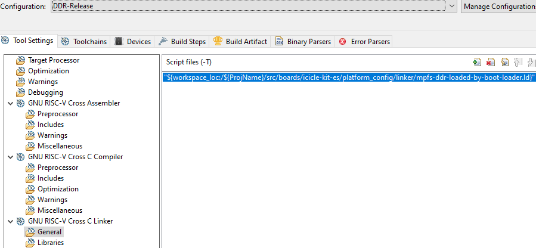
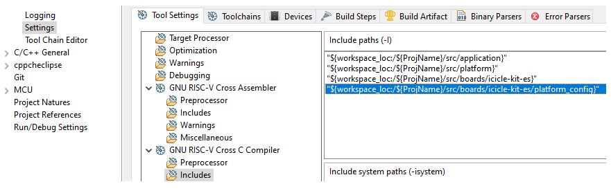
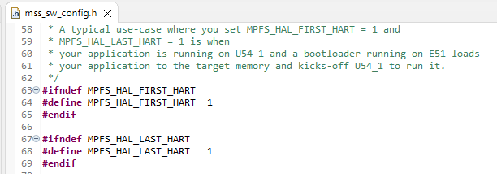
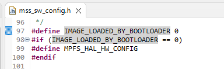
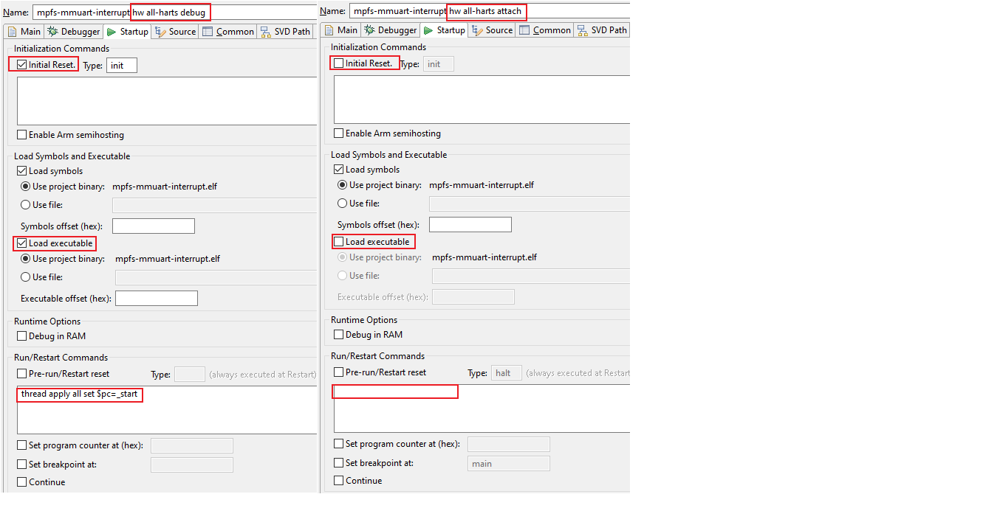

# PolarFire SoC Bare Metal Examples

This repository provides bare metal embedded software example projects with Microchip's
SoftConsole IDE.

- [Repo organization](#Repo-organization)
- [Supported targets](#Supported-targets)
- [Build configurations](#Build-configurations)
- [Debug launchers](#Debug-launchers)
- [Target hardware](#Target-hardware)
- [Customizing Bare metal project](#Customizing-Bare-metal-project)
- [Updating example projects](#Updating-example-projects)
- [References](#References)

<a name="Repo-organization"></a>
## Repo organization

```ruby
<repo>
  |-- applications
  |       |- .
  |       |- .
  |
  |
  |-- driver-examples
  |       |- mpfs-hal
  |       |- mss-can
  |       |- mss-ethernet-mac
  |       |     .
  |       |     .
  |       |     .
  |       |- mss-mmc
  |       |- mss-watchdog

```

The *applications* directory contains applications that are ready for use with
the PolarFire&reg; SoC Icicle kit.

The *driver-examples* directory contains example projects demonstrating the
PolarFire SoC Microprocessor Sub-System (MSS) peripheral device drivers.
These examples serve as an easy starting point for the users to start exploring
PolarFire SoC.

Each project provides a README.md explaining its functionality and usage instructions.
All projects provide a set of ready to use build configurations and debug launch
configurations. These are detailed in the following sections.

<a name="Supported-targets"></a>
## Supported targets

The table below contains a list of the projects in this repository and the boards they
support.

| Board | Supported projects |
|----|-----|
| icicle-kit-es | Supports all examples unless stated otherwise |
| mpfs-discovery-kit |  **MSS Peripherals:** <br> - mss-gpio: [mpfs-gpio-interrupt](./driver-examples/mss/mss-gpio/mpfs-gpio-interrupt)<br> - mss-rtc: [mpfs-rtc-time](./driver-examples/mss/mss-rtc/mpfs-rtc-time)<br> - mss-mmuart: [mpfs-mmuart-interrupt](./driver-examples/mss/mss-mmuart/mpfs-mmuart-interrupt)<br> |
| mpfs-video-kit |  **Applications:** <br>user-crypto: [mpfs-user-crypto-aes-cryptography](./applications/user-crypto/mpfs-user-crypto-aes-cryptography), [mpfs-user-crypto-ccm-services](./applications/user-crypto/mpfs-user-crypto-ccm-services), [mpfs-user-crypto-dsa-services](./applications/user-crypto/mpfs-user-crypto-dsa-services), <br>[mpfs-user-crypto-ecdsa-services](./applications/user-crypto/mpfs-user-crypto-ecdsa-services), [mpfs-user-crypto-key-agreement-services](./applications/user-crypto/mpfs-user-crypto-key-agreement-services), [mpfs-user-crypto-key-tree-services](./applications/user-crypto/mpfs-user-crypto-key-tree-services), <br>[mpfs-user-crypto-message-authentication-services](./applications/user-crypto/mpfs-user-crypto-message-authentication-services), [mpfs-user-crypto-ndrbg-services](./applications/user-crypto/mpfs-user-crypto-ndrbg-services), [mpfs-user-crypto-rsa-cryptography-services](./applications/user-crypto/mpfs-user-crypto-rsa-cryptography-services), <br>[mpfs-user-crypto-rsa-services](./applications/user-crypto/mpfs-user-crypto-rsa-services)<br><br> **MSS Peripherals:** <br> - mpfs-hal: [mpfs-hal-ddr-demo](./driver-examples/mss/mpfs-hal/mpfs-hal-ddr-demo), [mpfs-hal-power-saving-demo](./driver-examples/mss/mpfs-hal/mpfs-hal-power-saving-demo)<br>

<a name="Build-configurations"></a>
## Build configurations

The build configurations configure the projects to build in a specific way. For
example, Optimization level -Os, linking to DDR memory address space etc..
Below is the list of all the build configurations provided by default with each
project. You may use these build configurations or create your own to suit your
project.

|Configuration          | Description                                                                                                |  Example use case |
|-----------------------| ---------------------------------------------------------------------------------------------------------- |-------------------|
|LIM-Debug              | Download to and debug from LIM memory. Not-optimized (-O0). (Could be used with boot mode 0)               | This build configuration can be used to step-debug bare metal software typically in the initial development phase. The device should be configured to boot mode 0 and the embedded software loaded using the debugger. |
|LIM-Release            | Download to and debug from LIM memory. Optimized (-Os). (Could be used with boot mode 2)                   | This build configuration is similar to LIM-Debug build configuration but uses higher optimization level (-Os). It initially runs from LIM, configures scratchpad, copies itself to it and executes from there. This build configuration is closer to a typical release code and still allows step-debugging. |
|DDR-Release            | Execute from cached DDR memory – typically via a bootloader. Optimized (-Os).                              | This build configuration is used when this embedded software is going to be run from DDR memory. It is assumed at this point that the embedded software has been tested by either pre-configuring DDR (for example by using the HSS) and loading the embedded software into DDR using the debugger or by running the embedded software from the LIM. This can be used in an SMP or AMP configuration|
|eNVM-Scratchpad-Release| Booting from eNVM, program relocates itself to scratchpad memory and continues execution. Optimized (-Os). (Could be used with boot mode 1)| This build configuration is used when the embedded software is programmed to the eNVM and executes straight after the reset. It is assumed that this embedded software has already been tested using the LIM-Debug or LIM-Release configuration.|

A build configuration is a particular combination of SoftConsole project settings.

### SoftConsole project settings

Some of the important project settings are explained in following sections.

#### Debug build configurations

The build configurations post-fixed with '-Debug' are intended for the early
development and debug phase of the project. By convention, the *-Debug configurations
use optimization level -O0 and generate maximum debug symbol information.

#### Release build configurations

The build configurations post-fixed with '-Release' are intended for the final
production release, where an executable is stored in non-volatile memory and runs after
power-on-reset, or the executable is launched by a previous stage bootloader.
By convention, the *-Release configurations use optimization level (-Os) and do
not generate debug symbol information. They also define the NDEBUG macro which is
used to exclude any debug code from the build.



#### Linker scripts

Each build configuration needs a linker script. The linker
script describes the memory layout of the executable. Each build configuration
selects the appropriate linker script via the project settings for the build
configuration. For example, DDR-Release uses mpfs-ddr-loaded-by-boot-loader.ld.



There are several other settings that are required for a project. For complete
project settings go to

 1. \<project name> -> Project properties -> C/C++ Build -> Settings
 2. Select build configuration
 3. Navigate to the *Tool Settings* tab

### Configuration via header files

Apart from the SoftConsole project settings, each project needs a few more
configurations. These configurations are categorized into hardware and software configurations.

#### Hardware configurations

The hardware configurations are located in the \<project-root>/src/boards/\<target-board> folder.
The include files in the \<project-root>/src/boards/\<target-board>/fpga_design_config
folder define the hardware configurations such as clocks. These files are automatically
generated from the XML file provided in the \<project-root>/src/boards/\<target-board>/fpga_design/design_description
folder on each build. Each project contains XML matching the configuration in the
Icicle Kit Reference Design. You must make sure that the configurations in the
example project match the actual configurations of the Libero&reg; design that
you are using to test the example project. The design configuration data (XML)
generated from the MSS configuration used in your Libero project must be placed under
the \<project-root>/src/boards/\<target-board>/fpga_design/design_description folder.

To choose a particular hardware configuration, include an appropriate
\<project-root>/src/boards/\<target-board> folder path via the SoftConsole project
settings.

#### Software configurations

The default software configurations are stored under the \<project-root>/platform/platform_config_reference
folder. If you need to change the default software configurations, you are advised
to create a new folder to replicate this folder under the \<project-root>/src/boards/
directory and make the modifications there. It would look like \<project-root>/src/boards/\<target-board>/platform_config

The include files in the "platform_config" folder define the software configurations
such as the number of harts being used by the software, the tick rate of the
internal timer of each hart etc.. These configurations have no dependency on
the hardware configurations in the "fpga_design_config" folder. Note that changing
these software configurations may require a change in your application code.

To choose a particular software configuration, include either the platform_config_reference
or the project specific \<project-root>/src/boards/\<custom-board>/platform_config
path via the SoftConsole project settings.



##### MPFS_HAL_FIRST_HART and MPFS_HAL_LAST_HART

These defines are used to select the number of harts your application will use.

| Hart name|Hart number |
| ---      |---         |
| E51      |0   |  
| U54_1    |1   |  
| U54_2    |2   |  
| U54_3    |3   |  
| U54_4    |4   |  

A typical usecase is when you are developing the bootloader software to executed on
E51 which is run from eNVM and copies an application executable to the DDR memory
and wakes-up U54_1 alone to execute that application. In this case, the bootloader
software project will set MPFS_HAL_FIRST_HART = 0 and MPFS_HAL_LAST_HART = 1.

The application running on U54_1 will set MPFS_HAL_FIRST_HART = 1 and MPFS_HAL_LAST_HART = 1
as shown in the figure below.



##### IMAGE_LOADED_BY_BOOTLOADER

One of the important software configurations is the IMAGE_LOADED_BY_BOOTLOADER
in the mss_sw_config.h file. We set IMAGE_LOADED_BY_BOOTLOADER = 0 when no previous
stage bootloader is used. For example, when an application stored in eNVM starts
running after reset.

Set IMAGE_LOADED_BY_BOOTLOADER = 1 when the application's executable image
is loaded by a previous stage bootloader. The DDR-Release is one such configuration
which uses this setting. The modified mss_sw_config.h can be found  under
the \<project-root>/src/boards/\<icicle-kit-es>/platform_config folder.



<a name="Debug-launchers"></a>
## Debug launchers

The following two pre-configured debug launchers are provided with each project.

|Configuration              | Description                                                                                                |
|---------------------------|------------------------------------------------------------------------------------------------------------|
|*\<project name> hw all-harts debug.launch* | Intended to be used with *-Debug configurations. Resets MSS.<br> Downloads the executable and the symbols to the memory. Sets up PC to start location. |
|*\<project name> hw all-harts attach.launch* | Intended to be used with *-Release configurations. Does not reset MSS. <br> Loads only the symbol information and attaches to harts. Typically used to check the current state of harts. If the project is linked to RAM memory such as DDR, you will be able to set breakpoints, step, examine variables and debug further.|



Both launchers are configured to use the currently *active* build configuration.
Make sure that an appropriate build configuration is set as *active* to avoid issues.
executing on the harts **will not work**

You may change the existing debug launchers or create your own launcher to suit
your project.

<a name="Target-hardware"></a>
## Target hardware

All of the projects are tested on the PolarFire SoC Icicle kit. All the projects
are tested with the latest available Icicle kit [Reference Libero design](https://mi-v-ecosystem.github.io/redirects/repo-icicle-kit-reference-design)
or one of it's variants, unless noted otherwise. Please refer to the README.md in
each project for details.

<a name="Customizing-Bare-metal-project"></a>
## Customizing Bare metal project

When you make changes to the reference Libero design or create your own design,
the bare metal project will need to be customized for that design.

For an example walkthrough of customizing a bare metal application, watch our playlist:

[](https://mi-v-ecosystem.github.io/redirects/youtube-bare-metal-example-customization)

<a name="Updating-example-projects"></a>
## Updating example projects

When you want to update your SoftConsole example project to the latest release of *platform*,
please download the [platform repository](https://mi-v-ecosystem.github.io/redirects/repo-platform)
and replace the *src/platform* directory in the example project with it.
When you update the *platform* directory in your project, you must make sure
that the reference design (and the xml configuration) is compatible with it.
Also ensure that any customized mss_sw_config.h or linker scripts under
\<project-root>/src/boards/\<icicle-kit-es>/platform_config folder are also updated.

Some of the example projects under this repository may not contain the latest
versions of all the drivers or MPFS HAL. In such cases, you can copy the newly
downloaded *platform* folder in place of the *src/platform* directory.

<a name="References"></a>
## References

- For the latest releases of the MPFS HAL, peripheral device drivers and default
reference platform configurations, refer to the [PolarFire SoC platform](https://mi-v-ecosystem.github.io/redirects/repo-platform).

- For more details on the SoftConsole Bare metal software project folder structure,
refer to the [Bare Metal Software Projects Structure](https://mi-v-ecosystem.github.io/redirects/bare-metal-project-structure_bare-metal-software-project-structure).

- For more information on boot modes, refer to the [PolarFire SoC Boot Modes](https://mi-v-ecosystem.github.io/redirects/boot-modes_boot-modes-fundamentals).
and [polarfire-soc-boot-mode-programming-support-in-softconsole](https://mi-v-ecosystem.github.io/SoftConsole-Documentation/SoftConsole-v2021.3/using_softconsole/mpfs.html#polarfire-soc-boot-mode-programming-support-in-softconsole)

 ___
Libero&reg; and PolarFire&reg; are the property of Microchip Technology Inc. (MCHP).
