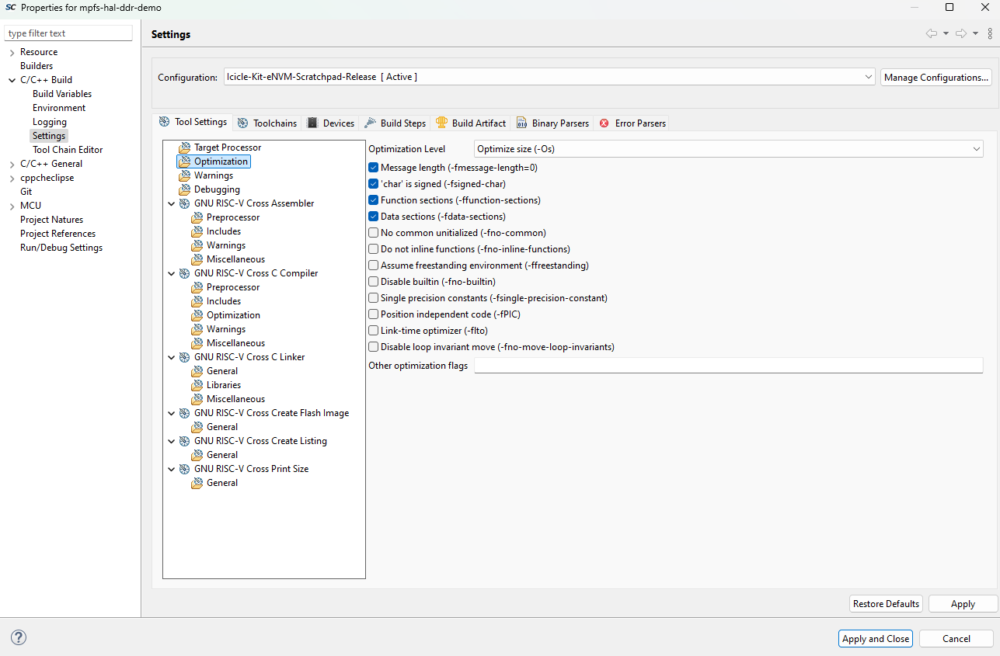
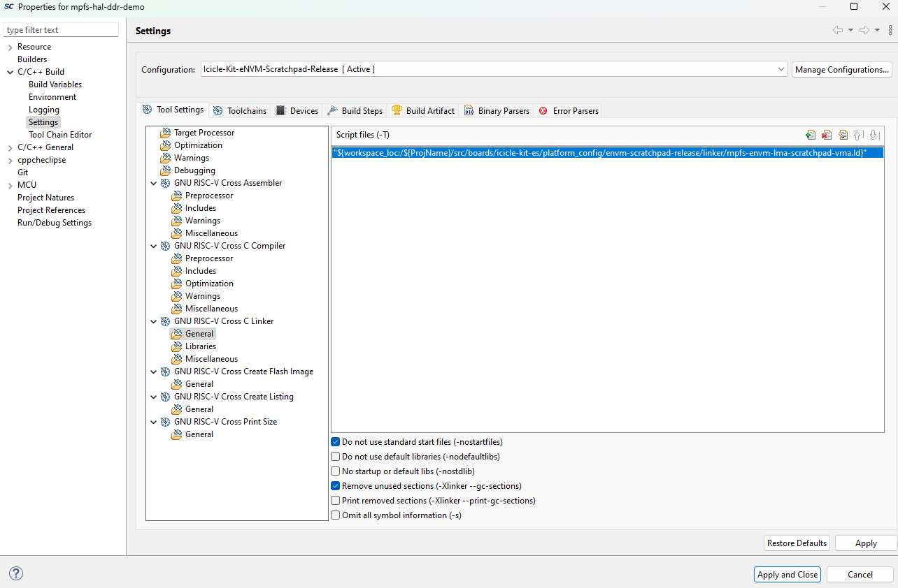
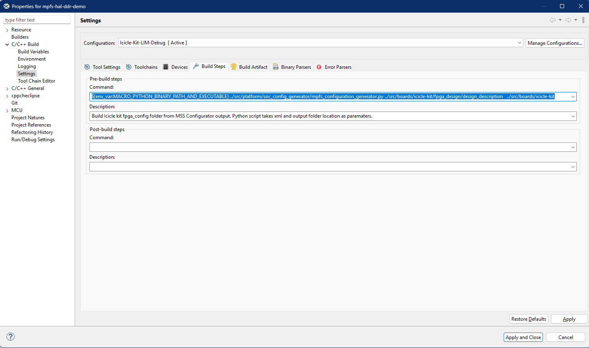
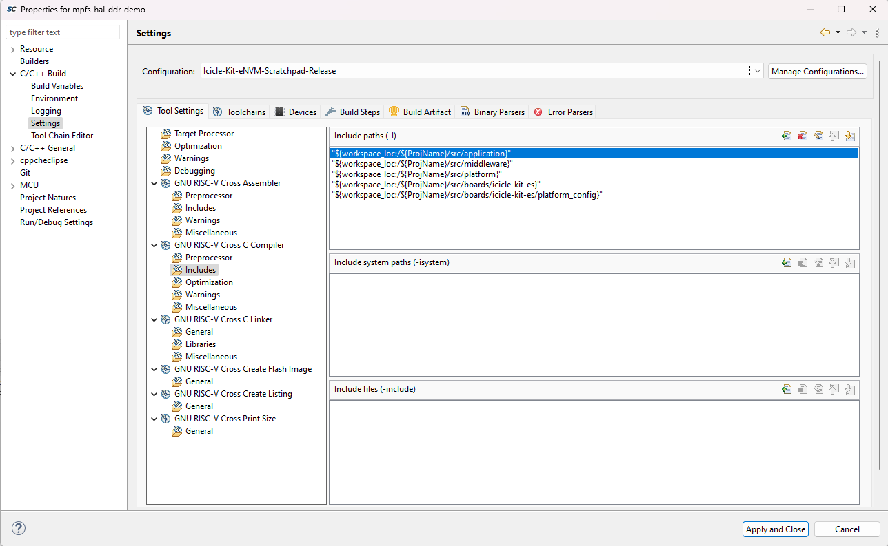
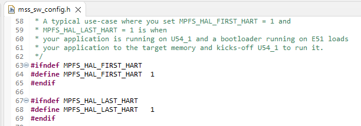
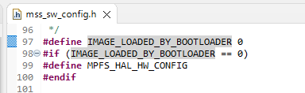
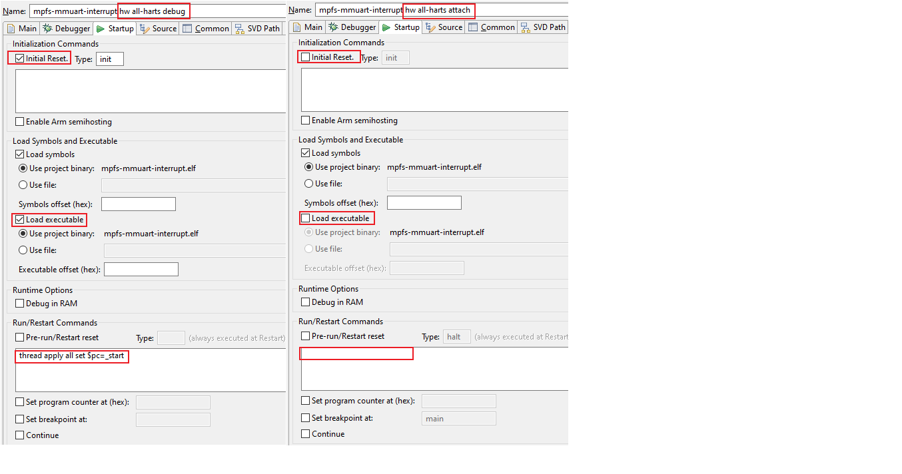
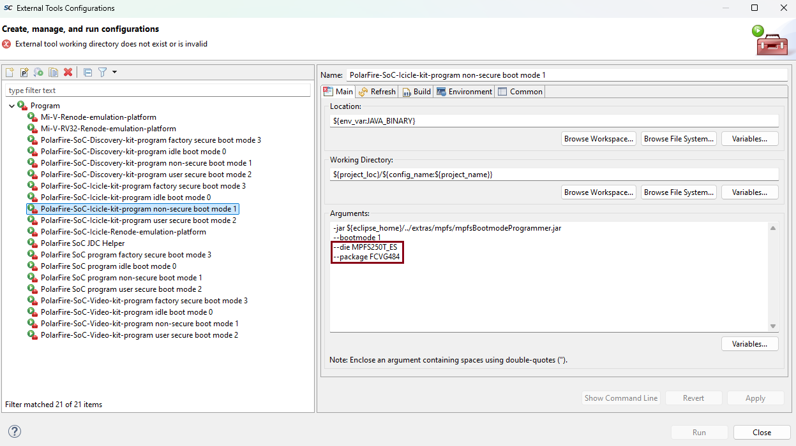
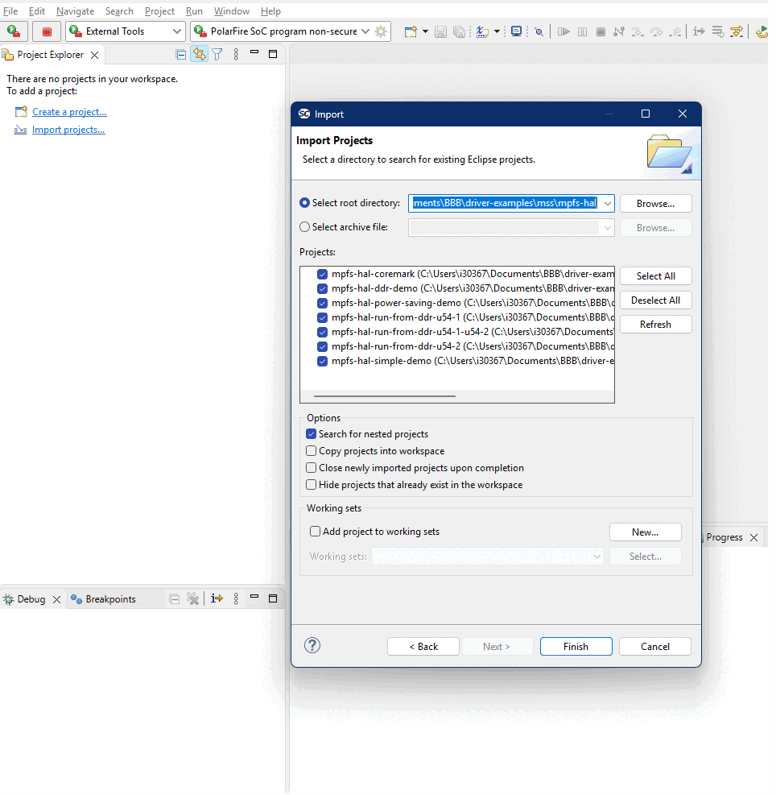
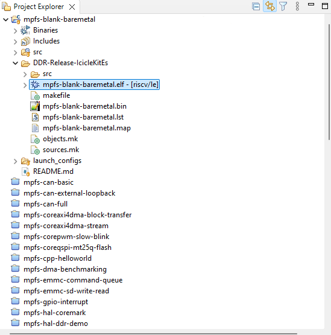

# PolarFire&reg; SoC Bare Metal Examples

---
- [PolarFire SoC Bare Metal Examples](#polarfire-soc-bare-metal-examples)
  - [1. Repository Structure](#1-repository-structure)
  - [2. Supported Devices](#2-supported-devices)
  - [3. Configuring and Building a Project](#3-configuring-and-building-a-project)
    - [3.1. Debug Build Configurations](#31-debug-build-configurations)
    - [3.2. Release Build Configurations](#32-release-build-configurations)
    - [3.3. Linker Scripts](#33-linker-scripts)
    - [3.4. Project Structure](#34-project-structure)
    - [3.5. Updating Example Projects](#35-updating-example-projects)
    - [3.6. Hardware Configurations](#36-hardware-configurations)
      - [3.6.1. Locating the Hardware Configurations](#361-locating-the-hardware-configurations)
      - [3.6.2. Customizing a Project with a Custom Libero Design](#362-customizing-a-project-with-a-custom-libero-design)
    - [3.7. Software Configurations](#37-software-configurations)
      - [3.7.1. `MPFS_HAL_FIRST_HART` and `MPFS_HAL_LAST_HART`](#371-mpfs_hal_first_hart-and-mpfs_hal_last_hart)
      - [3.7.2. `IMAGE_LOADED_BY_BOOTLOADER`](#372-image_loaded_by_bootloader)
    - [3.8. Renode Build Configurations](#38-renode-build-configurations)
  - [4. Launching a Project](#4-launching-a-project)
    - [4.1. Debug Launchers](#41-debug-launchers)
    - [4.2. Programming to LIM or eNVM](#42-programming-to-lim-or-envm)
      - [4.2.1. Configuring External Tools for Particular Boards (eNVM Release Only)](#421-configuring-external-tools-for-particular-boards-envm-release-only)
    - [4.3. Programming to DDR](#43-programming-to-ddr)
      - [4.3.1. Programming with the MPFS HAL DDR Demo](#431-programming-with-the-mpfs-hal-ddr-demo)
      - [4.3.2. Programming with the HSS Payload Generator](#432-programming-with-the-hss-payload-generator)
    - [4.4. Launching with Renode](#44-launching-with-renode)
  - [5. References](#5-references)

---

## 1. Repository Structure

> [!WARNING]
> On Windows, deeply nested repository locations can cause some file paths to exceed the path
> length limits in Git or other tools. If you encounter a "filename too long" error, clone or move
> the repository to a shorter location, such as `C:\pfsoc-examples`.

The following diagram (Figure 1) shows the structural hierarchy of the applications within the
polarfire-soc-bare-metal-examples repository:

```text
polarfire-soc-bare-metal-examples
               |
               |- applications <--------------------------------------------(a)
               |        |- benchmarks
               |        |- mpfs-blank-baremetal
               |        |- mpfs-cpp-helloworld
               |        |- .
               |        |- .
               |        |- user-crypto
               |
               |- driver-examples <-----------------------------------------(b)
               |        |- fpga-ip
               |            |- CoreAXI4DMAController
               |            |- CorePWM
               |            |- CoreQSPI
               |
               |        |- mss
               |            |- mpfs-hal
               |            |- mss-can
               |            |- mss-ethernet-mac
               |            |     .
               |            |     .
               |            |- mss-mmc
               |            |- mss-watchdog

  Fig. 1. (a) applications (b) driver-examples
```

The `applications` folder (Figure 1(a)) contains applications that are ready to use on your
PolarFire&reg; device. The `driver-examples` folder (Figure 1(b)) contains example projects that
demonstrate the PolarFire SoC Microprocessor Subsystem (MSS) peripheral device drivers. These
examples serve as an easy starting point for users to start exploring PolarFire SoC.

Each project provides its own README file, explaining the project's functionality and usage
instructions. All projects provide a set of ready-to-use build, debug, and launch configurations.
These are detailed in the following sections of this document.

## 2. Supported Devices

The table below contains a list of the projects in this repository and the boards they support:

| Development Board | Supported Examples |
| ----------------- | ------------------ |
| Icicle Kit | All examples except `user-crypto` examples, unless stated otherwise. |
| Icicle Kit ES | All examples except `user-crypto` examples, unless stated otherwise.<br><br>The IAP/Autoupdate service from `mpfs-sys-serv-example` is not supported on Icicle Kits with engineering sample (ES) devices. |
| BeagleV-Fire | **Driver examples**<br>&bull; `mss-ethernet-mac`: [mpfs-mac-mcc-stack](./driver-examples/mss/mss-ethernet-mac/mpfs-mac-mcc-stack)<br>&bull; `mss-ethernet-mac`: [mpfs-mac-simple-test](./driver-examples/mss/mss-ethernet-mac/mpfs-mac-simple-test)<br>&bull; `mss-ethernet-mac`: [mpfs-uart-mac-freertos_lwip](./driver-examples/mss/mss-ethernet-mac/mpfs-uart-mac-freertos_lwip) |
| Discovery Kit | **Applications**<br>&bull; `mpfs-blank-baremetal`: [mpfs-blank-baremetal](./applications/mpfs-blank-baremetal)<br><br>**Driver examples**<br>&bull; `core-pwm`: [mpfs-corepwm-slow-blink](./driver-examples/fpga-ip/CorePWM/mpfs-corepwm-slow-blink)<br>&bull; `mpfs-hal`: [mpfs-hal-ddr-demo](./driver-examples/mss/mpfs-hal/mpfs-hal-ddr-demo)<br>&bull; `mss-pdma`: [mpfs-pdma-read-write](./driver-examples/mss/mss-pdma/mpfs-pdma-read-write)<br>&bull; `mss-timer`: [mpfs-timer-example](./driver-examples/mss/mss-timer/mpfs-timer-example)<br>&bull; `mss-spi`: [mpfs-spi-master-slave](./driver-examples/mss/mss-spi/mpfs-spi-master-slave)<br>&bull; `mss-watchdog`: [mpfs-watchdog-interrupt](./driver-examples/mss/mss-watchdog/mpfs-watchdog-interrupt)<br>&bull; `mss-i2c`: [mpfs-i2c-master-slave](./driver-examples/mss/mss-i2c/mpfs-i2c-master-slave)<br>&bull; `mss-mmc`: [mpfs-emmc-sd-write-read](./driver-examples/mss/mss-mmc/mpfs-emmc-sd-write-read) |
| Video Kit | **Applications**<br>&bull; `user-crypto`: All examples, unless stated otherwise.<br><br>**Driver examples**<br>&bull; `mpfs-hal`: [mpfs-hal-ddr-demo](./driver-examples/mss/mpfs-hal/mpfs-hal-ddr-demo)<br>&bull; `mpfs-hal`: [mpfs-hal-power-saving-demo](./driver-examples/mss/mpfs-hal/mpfs-hal-power-saving-demo) |

Projects listed as supported on the PolarFire SoC Icicle Kit are tested with the latest available
[Icicle Kit Reference Libero design](https://mi-v-ecosystem.github.io/redirects/repo-icicle-kit-reference-design)
or one of its variants, unless noted otherwise. Refer to the README file in each
project for details.

> [!NOTE]
> From v2025.07 onwards, the Icicle Kit reference design provides two assets:
>
> - `MPFS_ICICLE_KIT_2025_07.zip` for newer Icicle Kits with a production PolarFire SoC FPGA
>   device (`MPFS250T`).
> - `MPFS_ICICLE_KIT_ES_2025_07.zip` for Icicle Kits with an engineering sample (ES) FPGA device
>   (`MPFS250T_ES`).
>
> Except for the die name, the `.cfg` and `.xml` files generated by the MSS Configurator are
> identical for both devices. Bare-metal projects do not use the die-name parameter for
> configuration, so all bare-metal examples continue to use the `boards/icicle-kit-es` folder for
> both kit versions. HSS uses separate folders for the two kits to manage the Linux boot sequence.

## 3. Configuring and Building a Project

The build configurations provide different options for running a project on your board. The main
options include memory selection (for example, LIM, scratchpad, or DDR) and optimization level (for
example, `-Os` or `-O0`). You may use these predefined configurations or create your own using the
SoftConsole project settings. The following table lists the main configurations provided by
default:

| Configuration | Description | Example Use |
| ------------- | ----------- | ----------- |
| `*-LIM-Debug` | Download to and debug from LIM memory. Not optimized (`-O0`). Can be used with boot mode 0. | Step-debug bare-metal software during initial development. Configure the device for boot mode 0 and load the software using the debugger. |
| `*-LIM-Release` | Download to and debug from LIM memory. Optimized for size (`-Os`). Can be used with boot mode 2. | Run initially from LIM, configure scratchpad memory, copy the program to it, and continue execution there. This configuration is closer to release code while still allowing step-debugging. |
| `*-DDR-Release` | Execute from cached DDR memory, typically via a bootloader. Optimized for size (`-Os`). | Run tested software from DDR in an SMP or AMP configuration. DDR can be initialized by HSS or another application before the software is loaded with the debugger. |
| `*-eNVM-Scratchpad-Release` | Boot from eNVM, relocate to scratchpad memory, and continue execution. Optimized for size (`-Os`). Can be used with boot mode 1. | Run software from eNVM after reset. Test the software first with a `*-LIM-Debug` or `*-LIM-Release` configuration. |

The asterisk represents a project-specific prefix. Depending on the project, a configuration may
use a board name, an application name, or no prefix. Select the exact configuration name shown in
SoftConsole for the imported project.

For example:

- `Discovery-Kit-DDR-Release`
- `Icicle-Kit-DDR-Release`
- `Discovery-Kit-LIM-Debug`
- `Icicle-Kit-LIM-Debug`

### 3.1. Debug Build Configurations

The build configurations suffixed with `-Debug` are intended for the debugging stages of your
project. By convention, the `-Debug` configurations use optimization level `-O0` and generate
maximum debug symbol information for the user.

### 3.2. Release Build Configurations

The build configurations suffixed with `-Release` are intended for the final release versions of
your projects, where an executable is stored in non-volatile memory and runs after power-on-reset,
or the executable is launched by a previous stage bootloader. By convention, the `-Release`
configurations use optimization level `-Os` and do not generate debug symbol information. They also
define the `NDEBUG` macro, which is used to exclude debug code from the build.



To open the **Properties** window in SoftConsole:

1. Select **Project** at the top of SoftConsole.
2. Select **Properties**, or use the `Ctrl+Alt+Shift+P` keyboard shortcut.

### 3.3. Linker Scripts

Each build configuration needs a linker script. The linker script describes the memory layout of the
executable. Each build configuration selects the appropriate linker script via the project settings
for the build configuration. For example, `*-DDR-Release` uses
`mpfs-ddr-loaded-by-boot-loader.ld` by default.

The table below shows each build configuration suffix and its corresponding default linker script.

| Build Configuration         | Linker Script                           |
| --------------------------- | --------------------------------------- |
| `*-LIM-Debug`               | `mpfs-lim.ld`                           |
| `*-LIM-Release`             | `mpfs-lim-lma-scratchpad-vma.ld`        |
| `*-DDR-Release`             | `mpfs-ddr-loaded-by-boot-loader.ld`     |
| `*-eNVM-Scratchpad-Release` | `mpfs-envm-lma-scratchpad-vma.ld`       |

> [!NOTE]
> If you need to modify the linker script for your project, copy the linker from the
> `<project-root>/src/platform/platform_config_reference` folder (Figure 2(g)) into the appropriate
> folder under `<project-root>/src/boards/<target-board>/platform_config` (Figure 2(e)) and make your
> changes there. Do not modify the linker scripts that are found in the
> `<project-root>/src/platform/platform_config_reference` folder. See Figure 2 below for more
> information on the project folder structure.

The following image shows where the linker path can be found and modified within the project
Properties window in SoftConsole:



To open the **Properties** window in SoftConsole:

1. Select **Project** at the top of SoftConsole.
2. Select **Properties**, or use the `Ctrl+Alt+Shift+P` keyboard shortcut.

### 3.4. Project Structure

The following diagram (Figure 2) shows the structural hierarchy of projects within the
polarfire-soc-bare-metal-examples repository:

```text
<project-root>
    |-- src
         |- application
         |- boards <--------------------------------------------------------(a)
         |      |- <target-board> <-----------------------------------------(b)
         |      .      |- fpga_design
         |      .      |       |- design_description <----------------------(c)
         |      .      |       |         |- *.xml
         |      .      |       |- mss_configuration
         |      .      |                 |- *.cfg
         |      .      |- fpga_design_config (generated during build) <-----(d)
         |      .      |       |- clocks
         |      .      |       |- ddr
         |      .      |       .
         |      .      |       .
         |      .      |       |- fpga_design_config.h
         |      .      |- platform_config <---------------------------------(e)
         |                     |- ddr-release
         |                     |         |- linker
         |                     |                |- *.ld
         |                     |         |- mpfs_hal_config
         |                     |                |- mss_sw_config.h
         |                     |- envm-scratchpad-release
         |                     |- lim-debug
         |                     |- lim-release
         |- middleware
         |- platform <------------------------------------------------------(f)
                |- drivers
                .
                .
                |- platform_config_reference <----------------------------- (g)
                .
                .

Fig. 2. (a) boards (b) <target-board> (c) design_description
        (d) fpga_design_config (e) platform_config
        (f) platform (g) platform_config_reference
```

### 3.5. Updating Example Projects

When you want to update your SoftConsole example project to the latest release of the platform
repository, please download the
[platform repository](https://mi-v-ecosystem.github.io/redirects/repo-platform) and replace the
`<project-root>/src/platform` directory (Figure 2(f)) in the example project with it. When you update
the `<project-root>/src/platform` folder, make sure that the reference design and the `.xml`
file are compatible with it. Also ensure that any customized `mss_sw_config.h` or linker scripts under
the `<project-root>/src/boards/<target-board>/platform_config` folder (Figure 2(e)) are also updated
accordingly.

### 3.6. Hardware Configurations

#### 3.6.1. Locating the Hardware Configurations

The hardware configurations are located in the `<project-root>/src/boards/<target-board>` folder
(Figure 2(b)). The header files in the
`<project-root>/src/boards/<target-board>/fpga_design_config` folder (Figure 2(d)) define the hardware
configurations such as clocks, memory, and I/O. These files are automatically generated from the
`.xml` file provided in the
`<project-root>/src/boards/<target-board>/fpga_design/design_description` folder (Figure 2(c)) on each
build. The `fpga_design_config` folder (Figure 2(d)) is not found in the project unless a build has been
successfully executed.

Each project contains an `.xml` file matching the configuration in the reference design. Make sure
that the configurations in the example project match the actual configurations of the Libero&reg;
design that you are using to test the example project. The design configuration data (`.xml` and `.cfg`),
generated from the MSS configuration used in your Libero project, must be placed under the
`<project-root>/src/boards/<target-board>/fpga_design/design_description` and
`<project-root>/src/boards/<target-board>/fpga_design/mss_configuration` folders (Figure 2(c)).

The following image shows the **Pre-build steps** command, which has three arguments:

1. Path to `mpfs_configuration_generator.py`, which generates the `fpga_design_config` folder
   (Figure 2(d)).
2. Path to the `design_description` folder (Figure 2(c)), where the `.xml` file is used as input.
3. Path to the `<target-board>` folder (Figure 2(b)), where `fpga_design_config` (Figure 2(d)) will be
   generated as an output.



To open the **Properties** window in SoftConsole:

1. Select **Project** at the top of SoftConsole.
2. Select **Properties**, or use the `Ctrl+Alt+Shift+P` keyboard shortcut.

#### 3.6.2. Customizing a Project with a Custom Libero Design

When you make changes to the reference Libero design or create your own design, the bare-metal
project will need to be customized for that design.

For an example walkthrough of customizing a bare-metal application, watch our playlist:

[](https://mi-v-ecosystem.github.io/redirects/youtube-bare-metal-example-customization)

### 3.7. Software Configurations

The files in the `<project-root>/src/boards/<target-board>/platform_config` folder (Figure 2(e))
define the software configurations, such as the number of harts being used by the software and the
tick rate of each hart's internal timer. These configurations have no dependency on the
hardware configurations in the `fpga_design_config` folder (Figure 2(d)).

> [!NOTE]
> Changing these software configurations may require changes to your application code.

The default software configurations are stored under the
`<project-root>/src/platform/platform_config_reference` folder (Figure 2(g)). These configuration
files should not be modified. The files that should be modified are found in
`<project-root>/src/boards/<target-board>/platform_config` (Figure 2(e)). If you need to change the
default software configurations, you are advised to create a new folder to replicate this folder
under the `<project-root>/src/boards` folder (Figure 2(a)) and make the modifications there. It would
look like
`<project-root>/src/boards/<target-board>/platform_config` (Figure 2(e)).

To choose a particular software configuration, include either `platform_config_reference` or the
project-specific `<project-root>/src/boards/<custom-board>/platform_config` path (Figure 2(e)) via the
SoftConsole project settings.



To open the **Properties** window in SoftConsole:

1. Select **Project** at the top of SoftConsole.
2. Select **Properties**, or use the `Ctrl+Alt+Shift+P` keyboard shortcut.

#### 3.7.1. `MPFS_HAL_FIRST_HART` and `MPFS_HAL_LAST_HART`

These defines select the inclusive range of hart IDs that the MPFS HAL starts for an application.
`MPFS_HAL_FIRST_HART` identifies the first hart in the range and
`MPFS_HAL_LAST_HART` identifies the last. Both values must be from 0 through 4, and the first value
must not be greater than the last value.

| Hart Name | Hart Number |
| --------- | ----------: |
| `E51`     |           0 |
| `U54_1`   |           1 |
| `U54_2`   |           2 |
| `U54_3`   |           3 |
| `U54_4`   |           4 |

The first selected hart performs the common system initialization. It then releases the other harts
in the selected range, in ascending hart-ID order. Harts outside the range remain in a
wait-for-interrupt (`WFI`) loop unless other software starts them. Because the range is contiguous,
selecting harts 1 and 3 also selects hart 2.

For example, consider a bootloader stored in eNVM that runs on the E51, copies a second application
to DDR, and starts that application on `U54_1`:

1. The bootloader project sets `MPFS_HAL_FIRST_HART = 0` and `MPFS_HAL_LAST_HART = 1`. The E51
   (hart 0) performs system initialization and then releases `U54_1` (hart 1).
2. The DDR application is built separately with `MPFS_HAL_FIRST_HART = 1` and
   `MPFS_HAL_LAST_HART = 1`. For this image, `U54_1` is both the first and last selected hart, so
   the application runs only on `U54_1`.

The figure below shows the settings for the DDR application.



#### 3.7.2. `IMAGE_LOADED_BY_BOOTLOADER`

One of the important software configurations is `IMAGE_LOADED_BY_BOOTLOADER` in the
`mss_sw_config.h` file. We set `IMAGE_LOADED_BY_BOOTLOADER = 0` when no previous stage bootloader
is used. For example, when an application stored in eNVM starts running after reset.

Set `IMAGE_LOADED_BY_BOOTLOADER = 1` when the application's executable image is loaded by a previous
stage bootloader. `*-DDR-Release` is one configuration that uses this setting. The
modified `mss_sw_config.h` can be found under the
`<project-root>/src/boards/<target-board>/platform_config` folder (Figure 2(e)).



### 3.8. Renode Build Configurations

Projects that support Renode include launchers whose names contain `renode`. The Renode debug
launcher uses the executable from the project's active build configuration. Before launching:

1. Select or create a build configuration for Renode.
2. Set `RENODE_DEBUG` in the project-specific `mss_sw_config.h` and make the configuration active.
3. Build the project and confirm that its `.elf` file is generated in the active build directory.
4. Check the project README for any Renode-specific configuration or peripheral limitations.

`RENODE_DEBUG` enables MPFS HAL behavior intended for emulation, including bypassing waits for
hardware-only status changes. Keep this symbol confined to the Renode build configuration; do not
define it in configurations used on physical hardware. Renode-related preprocessor symbols,
including `RENODE_DEBUG` and `RENODE_SIM_DDR_TRAINING`, are configured in the project-specific
`mss_sw_config.h` file.

DDR training is unnecessary in Renode because the emulated DDR is already reliable. If DDR training
is enabled, startup can take significantly longer. `RENODE_SIM_DDR_TRAINING` is a separate symbol
that skips the DDR training sequence while retaining DDR support. If the application does not use
DDR, you can instead disable `DDR_SUPPORT` in the project-specific `mss_sw_config.h`, as described
in [section 3.7](#37-software-configurations).

## 4. Launching a Project

### 4.1. Debug Launchers

The following two pre-configured debug launchers are provided with each project.

| Configuration | Description |
| ------------- | ----------- |
| `<project-name> hw all-harts debug.launch` | Use with `*-Debug` configurations. Resets the MSS, downloads the executable and symbols to memory, and sets the program counter to the start location. |
| `<project-name> hw all-harts attach.launch` | Use with `*-Release` configurations. Does not reset the MSS. Loads only symbol information and attaches to the harts. For programs linked to RAM such as DDR, you can set breakpoints, step through code, examine variables, and continue debugging. |

The following image shows the different debug configurations in SoftConsole:



To open the **Debug Configurations** window in SoftConsole:

1. Select **Run** at the top of SoftConsole.
2. Select **Debug Configurations**.

Both launchers use the currently **active** build configuration. Make sure that the appropriate
build configuration is active before launching the project.

The following table shows the correspondence between program launchers and build configurations.

| Program Launcher                       | Build Configuration |
| -------------------------------------- | ------------------- |
| PolarFire SoC program idle boot mode 0 | `*-LIM-Debug`       |

You may change the existing debug launchers or create your own launcher to suit your project.

### 4.2. Programming to LIM or eNVM

To program a PolarFire SoC bare-metal example onto your board using SoftConsole, use a program
launcher from the **External Tools** section. Each launcher corresponds to a particular build
configuration. Build the corresponding configuration before running the launcher; otherwise, the
program cannot be written to the board.

The following table shows the correspondence between program launchers and build configurations.

| Program Launcher                              | Build Configuration          |
| --------------------------------------------- | ---------------------------- |
| PolarFire SoC program non-secure boot mode 1  | `*-eNVM-Scratchpad-Release`  |
| PolarFire SoC program user-secure boot mode 2 | `*-LIM-Release`              |

#### 4.2.1. Configuring External Tools for Particular Boards (eNVM Release Only)

The board, FPGA die, and package must be specified correctly when using **External Tools** to program
the device. Set them as arguments in the **External Tools Configurations** window in SoftConsole.

Set the **External Tools Arguments** according to the FPGA die and package shown below.

| Attribute | Icicle Kit ES (Engineering Sample) | Icicle Kit (Production Silicon) | Video Kit  | Discovery Kit |
| --------- | ----------------------------------- | -------------------------------- | ---------- | ------------- |
| Die       | `MPFS250T_ES`                       | `MPFS250T`                       | `MPFS250T` | `MPFS095T`   |
| Package   | `FCVG484`                           | `FCVG484`                        | `FCG1152`  | `FCSG325`    |

> [!NOTE]
> The Icicle Kit ES and production boards use the same `Icicle-Kit-*` build configurations. The
> bare-metal projects also use the same `<project-root>/src/boards/icicle-kit-es` configuration for
> both devices. However, you must select the external tool launcher with the correct programming
> arguments. The ES launcher uses `--die MPFS250T_ES --package FCVG484`, while the production
> launcher uses `--die MPFS250T --package FCVG484`. The die differs between the boards, but the
> package is the same.

The following figure shows the External Tools Configurations window, and how
`PolarFire-SoC-Icicle-kit-ES-program non-secure boot mode 1` is configured for the Icicle Kit ES
device.



Alternatively, the
[`<project-root>/applications/mpfs-blank-baremetal`](./applications/mpfs-blank-baremetal) project
provides the external tool launchers for the various Microchip PolarFire SoC kits. Importing the
`<project-root>/applications/mpfs-blank-baremetal` project in your SoftConsole workspace and keeping
it open will make these tool launchers available in the SoftConsole IDE as demonstrated below.



### 4.3. Programming to DDR

There are two ways to load and run a bare-metal application from DDR: use the MPFS HAL DDR demo as a
simple bootloader, or create a payload for Hart Software Services (HSS).

#### 4.3.1. Programming with the MPFS HAL DDR Demo

The conventional method uses the
[`mpfs-hal-ddr-demo`](./driver-examples/mss/mpfs-hal/mpfs-hal-ddr-demo) project either as a standalone
DDR example or as a simple bootloader for another application:

##### Running the MPFS HAL DDR Demo

Use this flow to build and run the DDR demo itself:

1. Build `mpfs-hal-ddr-demo` using the `*-eNVM-Scratchpad-Release` configuration for your board.
2. Program the resulting image to eNVM using the appropriate SoftConsole external tool launcher, as
   described in [section 4.2](#42-programming-to-lim-or-envm).

##### Loading Another Example into DDR

With `mpfs-hal-ddr-demo` programmed and running as the bootloader, use this flow to run another
bare-metal example from DDR:

1. Build the target bare-metal application using its `*-DDR-Release` configuration.
2. Power-cycle the board and open the UART interface used by `mpfs-hal-ddr-demo`.
3. From the UART menu, select option 6, **Load image to DDR using YMODEM**, and transfer the `.bin`
   file generated by the target application build.
4. Press `a` in the UART menu to start the U54 cores from DDR.

#### 4.3.2. Programming with the HSS Payload Generator

This method requires HSS to be programmed in the target device's eNVM. Build the target application
using its `*-DDR-Release` configuration, then use the resulting `.elf` file and an HSS payload YAML
file to specify the target harts, entry points, and DDR addresses. Run the HSS Payload Generator to
create a payload `.bin` file, then write the payload to the eMMC or SD card from which HSS boots.



For configuration details and usage instructions, refer to the
[HSS Payload Generator](https://mi-v-ecosystem.github.io/redirects/tool-hss-payload-generator).

### 4.4. Launching with Renode

Renode runs the example on an emulated PolarFire SoC platform, so no physical board programming is
required. For projects that provide a combined launch group:

1. Build the project using the active configuration selected in
   [section 3.8](#38-renode-build-configurations).
2. In SoftConsole, open **Run > Debug Configurations**.
3. Select `<project-name> renode all-harts start-platform-and-debug`.
4. Start the configuration. It launches the Renode platform, waits for its GDB server, and then
   starts the project's Renode debug configuration.

The UART console and logging options are available on the **Startup** tab of
`<project-name> renode all-harts debug`.

If a project does not provide the combined launch group, start its Renode emulation platform from
**Run > External Tools**, wait until Renode is ready for a GDB connection, and then start the
project's `renode all-harts debug` configuration from **Run > Debug Configurations**. Refer to the
project README for the exact launcher names and any project-specific instructions.

## 5. References

- For the latest releases of the MPFS HAL, peripheral device drivers and default reference platform
  configurations, refer to the [PolarFire SoC platform](https://mi-v-ecosystem.github.io/redirects/repo-platform).
- For more details on the SoftConsole bare-metal software project folder structure, refer to the
  [Bare Metal Software Projects Structure](https://mi-v-ecosystem.github.io/redirects/bare-metal-project-structure_bare-metal-software-project-structure).
- For more information on boot modes, refer to the
  [PolarFire SoC Boot Modes](https://mi-v-ecosystem.github.io/redirects/boot-modes_boot-modes-fundamentals).
- For a fresh example project template with each necessary device configuration, refer to the
  [PolarFire SoC Bare Metal Examples repository](https://mi-v-ecosystem.github.io/redirects/repo-polarfire-soc-bare-metal-examples).

---

Libero&reg; and PolarFire&reg; are the property of Microchip Technology Inc. (MCHP).
