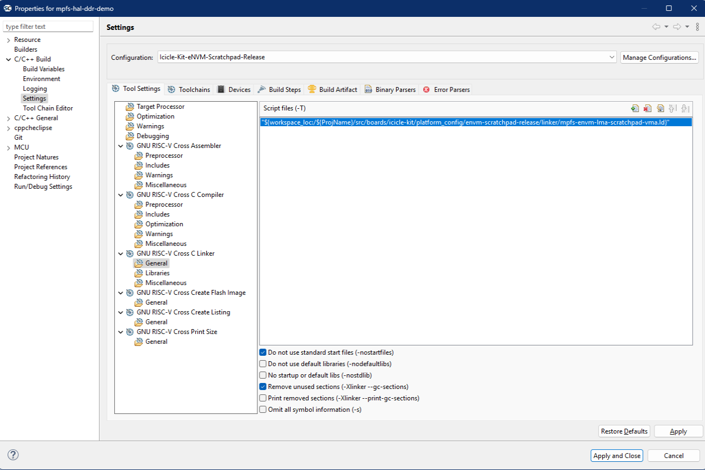
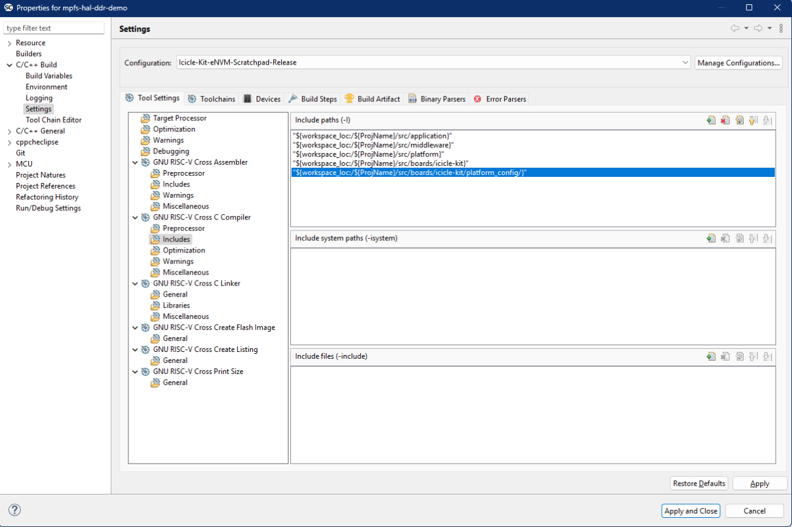
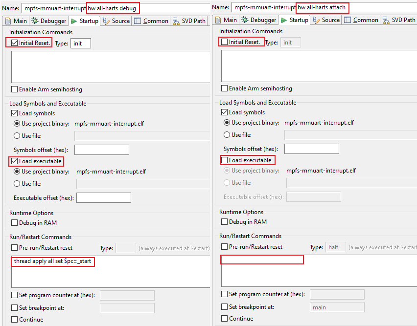
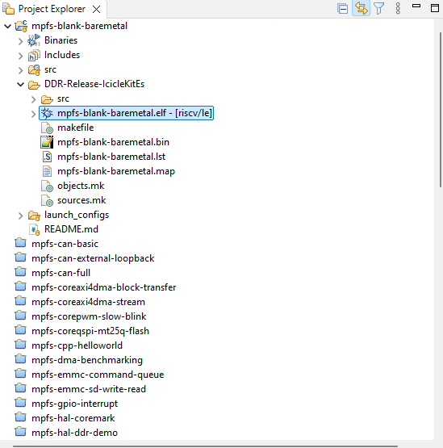

# PolarFire&reg; SoC Bare Metal Examples
---
- [PolarFire® SoC Bare Metal Examples](#polarfire-soc-bare-metal-examples)
  - [1. Repository Structure](#1-repository-structure)
  - [2. Supported Devices](#2-supported-devices)
  - [3. Configuring and Building Project](#3-configuring-and-building-project)
    - [3.1. Debug Build Configurations](#31-debug-build-configurations)
    - [3.2. Release Build Configurations](#32-release-build-configurations)
    - [3.3. Linker Scripts](#33-linker-scripts)
    - [3.4. Project Structure](#34-project-structure)
    - [3.5. Updating Example Projects](#35-updating-example-projects)
    - [3.6. Hardware Configurations](#36-hardware-configurations)
      - [3.6.1. Locating the Hardware Configurations](#361-locating-the-hardware-configurations)
      - [3.6.2. Customizing Project with Custom Libro Design](#362-customizing-project-with-custom-libro-design)
    - [3.7. Software Configurations](#37-software-configurations)
      - [3.7.1. MPFS\_HAL\_FIRST\_HART and MPFS\_HAL\_LAST\_HART](#371-mpfs_hal_first_hart-and-mpfs_hal_last_hart)
      - [3.7.2. IMAGE\_LOADED\_BY\_BOOTLOADER](#372-image_loaded_by_bootloader)
  - [4. Launching Project](#4-launching-project)
    - [4.1. Debug Launchers](#41-debug-launchers)
    - [4.1. Programming to LIM or eNVM](#41-programming-to-lim-or-envm)
      - [4.1.1. Configuring External Tools for Particular Boards (only for eNVM Release)](#411-configuring-external-tools-for-particular-boards-only-for-envm-release)
    - [4.2. Programming to DDR](#42-programming-to-ddr)
  - [6. References](#6-references)

---

## 1. Repository Structure

The following diagram (Figure 1) shows the structural hierarchy of the applications within the
polarfire-soc-bare-metal-examples repository:

```ruby
polarfire-soc-bare-metal-examples
               |
               |- applications <--------------------------------------------(a)
               |        |- benchmarks
               |        |- mpfs-blank-baremetal
               |        |- mpfs-cpp-helloworld
               |        |- .
               |        |- .
               |        |- user-crypto
               |
               |- driver-examples <-----------------------------------------(b)
               |        |- fpga-ip
               |            |- CoreAXI4DMAController
               |            |- CorePWM
               |            |- CoreQSPI
               |
               |        |- mss
               |            |- mpfs-hal
               |            |- mss-can
               |            |- mss-ethernet-mac
               |            |     .
               |            |     .
               |            |- mss-mmc
               |            |- mss-watchdog

  Fig. 1. (a) applications (b) driver-examples
```

The ***applications (Fig. 1(a))*** folder contains applications that are ready-to-use on your
PolarFire&reg; device. The ***driver-examples (Fig. 1(b))*** folder contains example projects that
demonstrate the PolarFire SoC Microprocessor Sub-System (MSS) peripheral device drivers. These
examples serve as an easy starting point for users to start exploring PolarFire SoC.

Each project provides its own README markdown file, explaining the project's functionality and usage
instructions. All projects provide a set of ready-to-use build, debug, and launch configurations.
These are detailed in the following sections of this document.

## 2. Supported Devices

The table below contains a list of the projects in this repository and the boards they support:

| Board              | Supported projects                                                                                                                                                                                                                                                                                                                                                                                                                                                                                                                                                                                                                                                                                                                                                                                                                                                                                                                                                                                                                                                                                                                                                                                                                                                                                                            |
| ------------------ | ----------------------------------------------------------------------------------------------------------------------------------------------------------------------------------------------------------------------------------------------------------------------------------------------------------------------------------------------------------------------------------------------------------------------------------------------------------------------------------------------------------------------------------------------------------------------------------------------------------------------------------------------------------------------------------------------------------------------------------------------------------------------------------------------------------------------------------------------------------------------------------------------------------------------------------------------------------------------------------------------------------------------------------------------------------------------------------------------------------------------------------------------------------------------------------------------------------------------------------------------------------------------------------------------------------------------------- |
| icicle-kit         | Supports all examples unless stated otherwise                                                                                                                                                                                                                                                                                                                                                                                                                                                                                                                                                                                                                                                                                                                                                                                                                                                                                                                                                                                                                                                                                                                                                                                                                                                                                 |
| icicle-kit-es      | Supports all examples unless stated otherwise                                                                                                                                                                                                                                                                                                                                                                                                                                                                                                                                                                                                                                                                                                                                                                                                                                                                                                                                                                                                                                                                                                                                                                                                                                                                                 |
| mpfs-discovery-kit | **Applications:** <br> - mpfs-blank-baremetal: [mpfs-blank-baremetal](./applications/mpfs-blank-baremetal) <br><br> **Driver Examples:** <br> - core-pwm: [mpfs-corepwm-slow-blink](./driver-examples/fpga-ip/CorePWM/mpfs-corepwm-slow-blink) <br> - mpfs-hal: [mpfs-hal-ddr-demo](./driver-examples/mss/mpfs-hal/mpfs-hal-ddr-demo) <br> - mss-pdma: [mpfs-pdma-read-write](./driver-examples/mss/mss-pdma/mpfs-pdma-read-write) <br> - mss-timer: [mpfs-timer-example](./driver-examples/mss/mss-timer/mpfs-timer-example) <br> - mss-spi: [mpfs-spi-master-slave](./driver-examples/mss/mss-spi/mpfs-spi-master-slave) <br> - mss-watchdog: [mpfs-watchdog-interrupt](./driver-examples/mss/mss-watchdog/mpfs-watchdog-interrupt) <br> - mss-i2c: [mpfs-i2c-master-slave](./driver-examples/mss/mss-i2c/mpfs-i2c-master-slave) <br> - mss-mmc: [mpfs-emmc-sd-write-read](./driver-examples/mss/mss-mmc/mpfs-emmc-sd-write-read)                                                                                                                                                                                                                                                                                                                                                                                           |
| mpfs-video-kit     | **Applications:** <br> - user-crypto: [mpfs-user-crypto-aes-cryptography](./applications/user-crypto/mpfs-user-crypto-aes-cryptography), [mpfs-user-crypto-ccm-services](./applications/user-crypto/mpfs-user-crypto-ccm-services), [mpfs-user-crypto-dsa-services](./applications/user-crypto/mpfs-user-crypto-dsa-services), <br>[mpfs-user-crypto-ecdsa-services](./applications/user-crypto/mpfs-user-crypto-ecdsa-services), [mpfs-user-crypto-key-agreement-services](./applications/user-crypto/mpfs-user-crypto-key-agreement-services), [mpfs-user-crypto-key-tree-services](./applications/user-crypto/mpfs-user-crypto-key-tree-services), <br>[mpfs-user-crypto-message-authentication-services](./applications/user-crypto/mpfs-user-crypto-message-authentication-services), [mpfs-user-crypto-ndrbg-services](./applications/user-crypto/mpfs-user-crypto-ndrbg-services), [mpfs-user-crypto-rsa-cryptography-services](./applications/user-crypto/mpfs-user-crypto-rsa-cryptography-services), <br>[mpfs-user-crypto-rsa-services](./applications/user-crypto/mpfs-user-crypto-rsa-services)<br><br> **Driver Examples:** <br> - mpfs-hal: [mpfs-hal-ddr-demo](./driver-examples/mss/mpfs-hal/mpfs-hal-ddr-demo), [mpfs-hal-power-saving-demo](./driver-examples/mss/mpfs-hal/mpfs-hal-power-saving-demo)<br> |

All of the projects are tested on the PolarFire SoC Icicle kit. All the projects are tested with the
latest available [Icicle kit Reference Libero design](https://github.com/polarfire-soc/icicle-kit-reference-design) or one of it's variants, unless noted otherwise.
Please refer to the README markdown file in each project for details.

## 3. Configuring and Building Project

The build configurations provide you with different options on how you want your project to run on
your board. The main options available include memory selection (e.g. LIM, Scratchpad, DDR) and
optimization level (e.g. -Os, -O0 etc.). You may use these pre-made configurations, or create your
own configuration using the SoftConsole project settings. Below is the list of all the main build
configurations provided by default with each project:

| Configuration           | Description                                                                                                                                 | Example use case                                                                                                                                                                                                                                                                                                                                                                                      |
| ----------------------- | ------------------------------------------------------------------------------------------------------------------------------------------- | ----------------------------------------------------------------------------------------------------------------------------------------------------------------------------------------------------------------------------------------------------------------------------------------------------------------------------------------------------------------------------------------------------  |
| LIM-Debug               | Download to and debug from LIM memory. Not-optimized (-O0). (Could be used with boot mode 0)                                                | This build configuration can be used to step-debug bare metal software typically in the initial development phase. The device should be configured to boot mode 0 and the embedded software loaded using the debugger.                                                                                                                                                                                |
| LIM-Release             | Download to and debug from LIM memory. Optimized (-Os). (Could be used with boot mode 2)                                                    | This build configuration is similar to LIM-Debug build configuration but uses higher optimization level (-Os). It initially runs from LIM, configures scratchpad, copies itself to it and executes from there. This build configuration is closer to a typical release code and still allows step-debugging.                                                                                          |
| DDR-Release             | Execute from cached DDR memory – typically via a bootloader. Optimized (-Os).                                                               | This build configuration is used when this embedded software is going to be run from DDR memory. It is assumed at this point that the embedded software has been tested by either pre-configuring DDR (for example by using the HSS) and loading the embedded software into DDR using the debugger or by running the embedded software from the LIM. This can be used in an SMP or AMP configuration. |
| eNVM-Scratchpad-Release | Booting from eNVM, program relocates itself to scratchpad memory and continues execution. Optimized (-Os). (Could be used with boot mode 1) | This build configuration is used when the embedded software is programmed to the eNVM and executes straight after the reset. It is assumed that this embedded software has already been tested using the LIM-Debug or LIM-Release configuration.                                                                                                                                                      |

### 3.1. Debug Build Configurations

The build configurations post-fixed with \*-Debug are intended for the debugging stages of your
project. By convention, the \*-Debug configurations use optimization level -O0 and generate maximum
debug symbol information for the user.

### 3.2. Release Build Configurations

The build configurations post-fixed with \*-Release are intended for the final release versions of
your projects, where an executable is stored in non-volatile memory and runs after power-on-reset,
or the executable is launched by a previous stage bootloader. By convention, the \*-Release
configurations use optimization level -Os and do not generate debug symbol information. They also
define the NDEBUG macro which is used to exclude any debug code from the build.


To open *Properties* window in SoftConsole:
1. Click *Project* tab at the top of your SoftConsole instance.
2. Click *Properties*. (or use keyboard shortcut Ctrl+Alt+Shift+P)

### 3.3. Linker Scripts

Each build configuration needs a linker script. The linker script describes the memory layout of the
executable. Each build configuration selects the appropriate linker script via the project settings
for the build configuration. For example, DDR-Release by default uses
mpfs-ddr-loaded-by-boot-loader.ld.

The table below shows the build configuration and it's default corresponding linker script.

| Build Configuration     | Linker Script                     |
|-------------------------|-----------------------------------|
| LIM-Debug               | mpfs-lim.ld                       |
| LIM-Release             | mpfs-lim-lma-scratchpad-vma.ld    |
| DDR-Release             | mpfs-ddr-loaded-by-boot-loader.ld |
| eNVM-Scratchpad-Release | mpfs-envm-lma-scratchpad-vma.ld   |

**Note**:
If you need to modify the linker script for your project, copy the linker from the
*/**platform_config_reference (Fig. 2(g))*** folder into the appropriate folder under
*/**platform_config (Fig. 2(e))*** and make your changes there. Do not modify the linker scripts
that are found in the */**platform_config_reference (Fig. 2(g))*** folder. See Figure 2 below for
more infomation on the folder structure for your project.

The following image shows where the linker path can be found and modified within the project
Properties window in SoftConsole:



To open *Properties* window in SoftConsole:
1. Click *Project* tab at the top of your SoftConsole instance.
2. Click *Properties*. (or use keyboard shortcut Ctrl+Alt+Shift+P)

### 3.4. Project Structure

The following diagram (Figure 2) shows the structural hierararchy of projects within the
polarfire-soc-bare-metal-examples repository:

```ruby
<project-root>
    |-- src
         |- application
         |- boards <--------------------------------------------------------(a)
         |      |- <target-board> <-----------------------------------------(b)
         |      .      |- fpga_design
         |      .      |       |- design_description <----------------------(c)
         |      .      |       |         |- *.xml
         |      .      |       |- mss_configuration
         |      .      |                 |- *.cfg
         |      .      |- fpga_design_config (generated during build) <-----(d)
         |      .      |       |- clocks
         |      .      |       |- ddr
         |      .      |       .
         |      .      |       .
         |      .      |       |- fpga_design_config.h
         |      .      |- platform_config <---------------------------------(e)
         |                     |- ddr-release
         |                     |         |- linker
         |                     |                |- *.ld
         |                     |         |- mpfs_hal_config
         |                     |                |- mss_sw_config.h
         |                     |- envm-scratchpad-release
         |                     |- lim-debug
         |                     |- lim-release
         |- middleware
         |- platform <------------------------------------------------------(f)
                |- drivers
                .
                .
                |- platform_config_reference <----------------------------- (g)
                .
                .

Fig. 2. (a) boards (b) <target-board> (c) design_description
        (d) fpga_design_config (e) platform_config
        (f) platform (g) platform_config_reference
```

### 3.5. Updating Example Projects

When you want to update your SoftConsole example project to the latest release of the platform
repository, please download the [platform repository](https://mi-v-ecosystem.github.io/redirects/repo-platform) and replace the */src/**platform (Fig. 2(f))*** directory in the
example project with it. When you update the */src/**platform (Fig. 2(f))*** folder in your project, you must make
sure that the reference design and the .xml file are compatible with it. Also ensure that any
customized mss_sw_config.h or linker scripts under *\<project-root>/src/boards/\<icicle-kit-es>
/**platform_config (Fig. 2(e))*** folder are also updated accordingly.

### 3.6. Hardware Configurations

#### 3.6.1. Locating the Hardware Configurations

The hardware configurations are located in the *\<project-root>/src/boards/**\<target-board> (Fig. 2(b))***
folder. The header files in the *\<project-root>/src/boards/\<target-board>/**fpga_design_config
(Fig. 2(d))*** folder define the hardware configurations such as clocks, memory, IO etc. These
files are automatically generated from the .xml file provided in the *\<project-root>/src/boards
/\<target-board>/fpga_design/**design_description (Fig. 2(c))*** folder on each build. The
***fpga_design_config (Fig. 2(d))*** folder is not found in the project unless a build has been
successfully executed.

Each project contains an .xml matching the configuration in the reference design. You must make sure
that the configurations in the example project match the actual configurations of the Libero&reg;
design that you are using to test the example project. The design configuration data (.xml and .cfg),
generated from the MSS configuration used in your Libero project, must be placed under the
*\<project-root>/src/boards/\<target-board>/fpga_design/**design_description (Fig. 2(c))*** and
*\<project-root>/src/boards/\<target-board>/fpga_design/**mss_configuration (Fig. 2(c))***
folders.


The following image shows the *Pre-build steps* command which has three arguments:
1. Path to mpfs_configuration_generator.py, which generates ***fpga_design_config (Fig. 2(d))***
   folder.
2. Path to the ***design_description (Fig. 2(c))*** folder, where the .xml file is used as an input.
3. Path to the ***\<target-board> (Fig. 2(b))*** folder, where ***fpga_design_config (Fig. 2(d))***
   will be generated as on output.


To open *Properties* window in SoftConsole:
1. Click *Project* tab at the top of your SoftConsole instance.
2. Click *Properties*. (or use keyboard shortcut Ctrl+Alt+Shift+P)

#### 3.6.2. Customizing Project with Custom Libro Design

When you make changes to the reference Libero design or create your own design, the bare metal
project will need to be customized for that design.

For an example walkthrough of customizing a bare metal application, watch our playlist:

[](https://mi-v-ecosystem.github.io/redirects/youtube-bare-metal-example-customization)


### 3.7. Software Configurations

The files in the *\<project-root>/src/boards/\<target-board>/**platform_config (Fig. 2(e))*** folder
define the software configurations, such as the number of harts being used by the software and the
tick rate of the internal timer of each hart etc. These configurations have no dependency on the
hardware configurations in the ***fpga_design_config Fig 2(d)*** folder.

Note: Changing these software configurations may require a change in your application code.

The default software configurations are stored under the *\<project-root>/platform
/**platform_config_reference (Fig. 2(g))*** folder. These configuration files should not be
modified. The files that should be modified are found in */**platform_config (Fig. 2(e))***. If you
need to change the default software configurations, you are advised to create a new folder to
replicate this folder under the *\<project-root>/src/**boards (Fig. 2(a))*** folder and make the
modifications there. It would look like *\<project-root>/src/boards/\<target-board>
/**platform_config (Fig. 2(e))***


To choose a particular software configuration, include either the platform_config_reference or the
project specific *\<project-root>/src/boards/\<custom-board>/**platform_config (Fig. 2(e))***
path via the SoftConsole project settings.



To open *Properties* window in SoftConsole:
1. Click *Project* tab at the top of your SoftConsole instance.
2. Click *Properties*. (or use keyboard shortcut Ctrl+Alt+Shift+P)

#### 3.7.1. MPFS_HAL_FIRST_HART and MPFS_HAL_LAST_HART

These defines are used to select the number of harts your application will use.

| Hart name | Hart number |
| --------- | ----------- |
| E51       | 0           |
| U54_1     | 1           |
| U54_2     | 2           |
| U54_3     | 3           |
| U54_4     | 4           |

A typical usecase is when you are developing the bootloader software to be executed on E51 which is
run from eNVM and copies an application executable to the DDR memory and wakes-up U54_1 alone to
execute that application. In this case, the bootloader software project will set MPFS_HAL_FIRST_HART
= 0 and MPFS_HAL_LAST_HART = 1.

The application running on U54_1 will set MPFS_HAL_FIRST_HART = 1 and MPFS_HAL_LAST_HART = 1 as
shown in the figure below.


#### 3.7.2. IMAGE_LOADED_BY_BOOTLOADER

One of the important software configurations is the IMAGE_LOADED_BY_BOOTLOADER in the
mss_sw_config.h file. We set IMAGE_LOADED_BY_BOOTLOADER = 0 when no previous stage bootloader
is used. For example, when an application stored in eNVM starts running after reset.

Set IMAGE_LOADED_BY_BOOTLOADER = 1 when the application's executable image is loaded by a previous
stage bootloader. The DDR-Release is one such configuration which uses this setting. The
modified mss_sw_config.h can be found under the *\<project-root>/src/boards/\<icicle-kit-es>
/**platform_config folder (Fig. 1(e))***.


## 4. Launching Project

### 4.1. Debug Launchers

The following two pre-configured debug launchers are provided with each project.

| Configuration                                | Description                                                                                                                                                                                                                                                                                                                   |
| -------------------------------------------- | ----------------------------------------------------------------------------------------------------------------------------------------------------------------------------------------------------------------------------------------------------------------------------------------------------------------------------- |
| *\<project name> hw all-harts debug.launch*  | Intended to be used with \*-Debug configurations. Resets MSS.<br> Downloads the executable and the symbols to the memory. Sets up PC to start location.                                                                                                                                                                       |
| *\<project name> hw all-harts attach.launch* | Intended to be used with \*-Release configurations. Does not reset MSS. <br> Loads only the symbol information and attaches to harts. Typically used to check the current state of harts. If the project is linked to RAM memory such as DDR, you will be able to set breakpoints, step, examine variables and debug further. |

The following image shows the different debug configurations in SoftConsole:



To open *Debug Configurations* window in SoftConsole:
1. Click *Run* tab at the top of your SoftConsole instance.
2. Click *Debug Configurations*.

Both launchers are configured to use the currently *active* build configuration. Make sure that an
appropriate build configuration is set as *active* to avoid issues. Executing on the harts will
not work.

The following table shows the correspondence between program launchers and build configurations.

| Program Launcher                              | Build Configuration     |
| --------------------------------------------- | ----------------------- |
| PolarFire SoC program idle boot mode 0        | LIM-Debug               |

You may change the existing debug launchers or create your own launcher to suit your project.

### 4.1. Programming to LIM or eNVM

To program the PolarFire SoC Bare Metal Examples on to your desired board using SoftConsole, the
program launchers found in the External Tools section of SoftConsole are the way to achieve this.
These program launchers correspond with a particular build configuration. If you try to run a
program launcher without first running the corresponding build, the program will not be flashed
onto the board.

The following table shows the correspondence between program launchers and build configurations.

| Program Launcher                              | Build Configuration     |
| --------------------------------------------- | ----------------------- |
| PolarFire SoC program non-secure boot mode 1  | eNVM-Scratchpad-Release |
| PolarFire SoC program user-secure boot mode 2 | LIM-Release             |

#### 4.1.1. Configuring External Tools for Particular Boards (only for eNVM Release)

The board you are using, as well as it's associated die and package, matters when using the External
Tools to program your device. These must be correctly specified as arguments in the External Tools
Configurations window in SoftConsole.

Depending on the die and package you are using, you will need to set the External Tools Arguments 
according to the following table.

|             | Icicle Kit ES (Engineering Sample) | Icicle Kit (Production Silicon) | Video Kit | Discovery Kit |
|-------------|------------------------------------|---------------------------------|-----------|---------------|
| **Die**     | MPFS250T_ES                        | MPFS250T                        | MPFS250T  | MPFS095T      |
| **Package** | FCVG484                            | FCVG484                         | FCG1152   | FCSG325       |

The following figure shows the External Tools Configurations window, and how
*PolarFire-SoC-Icicle-kit-program non-secure boot mode 1* is configured for the Icicle Kit ES
device.


### 4.2. Programming to DDR

To program the PolarFire SoC Bare Metal Examples to the DDR of your desired board. You will first
have to execute a DDR-Release build for your project. You will then have to use the .elf file(s)
that you generated from your build, and generate a payload to target a specific section(s) of DDR
memory space. This can be done using the hss-payload-generator found with the
hart-software-services. Once you generated your payload in the form of a .bin, you can then flash it
onto your device.



Please click for information on the [HSS Payload Generator](https://github.com/polarfire-soc/hart-software-services/tree/master/tools/hss-payload-generator)

## 6. References

- For the latest releases of the MPFS HAL, peripheral device drivers and default reference platform
  configurations, refer to the [PolarFire SoC platform](https://mi-v-ecosystem.github.io/redirects/repo-platform).
- For more details on the SoftConsole Bare metal software project folder structure, refer to the
  [Bare Metal Software Projects Structure](https://mi-v-ecosystem.github.io/redirects/bare-metal-project-structure_bare-metal-software-project-structure).
- For more information on boot modes, refer to the [PolarFire SoC Boot Modes](https://mi-v-ecosystem.github.io/redirects/boot-modes_boot-modes-fundamentals), and
  [polarfire-soc-boot-mode-programming-support-in-softconsole](https://mi-v-ecosystem.github.io/SoftConsole-Documentation/SoftConsole-v2021.3/using_softconsole/mpfs.html#polarfire-soc-boot-mode-programming-support-in-softconsole)
- For a fresh example project template with each necessary device configuration, refer to the
  [MPFS Blank Baremetal Example Project](https://github.com/polarfire-soc/polarfire-soc-bare-metal-examples/tree/main/applications/mpfs-blank-baremetal).

---

Libero&reg; and PolarFire&reg; are the property of Microchip Technology Inc. (MCHP).
