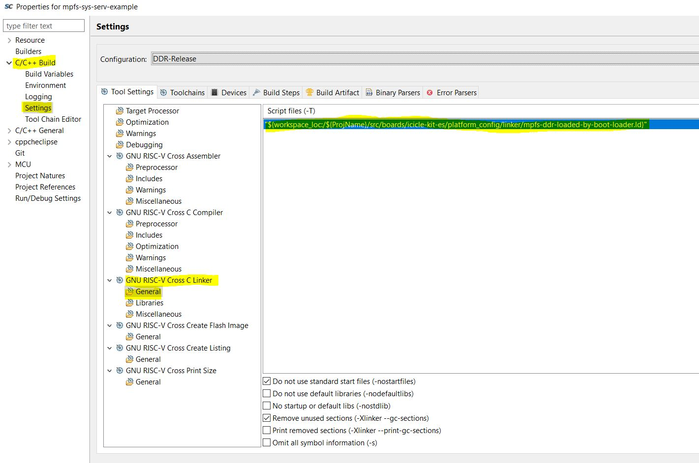

* Please Refer to original linker files located here : ```platform/platform_config_reference/linker/```
* If require any customization on linker file, copy linker file from ```platform/platform_config_reference/linker```
into ```src/boards/icicle-kit-es/platform_config/linker/``` and change the linker files as per need, and make sure to include it in linker include path 
* for more details, follow [link](https://github.com/polarfire-soc/polarfire-soc-bare-metal-examples)